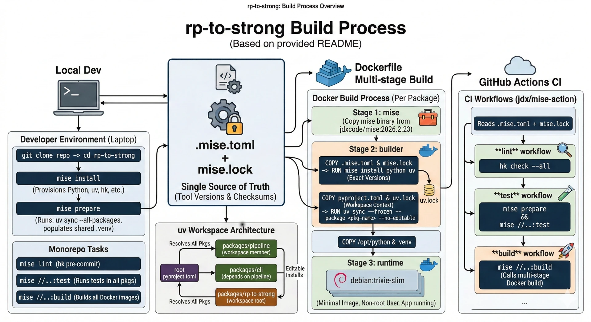

# rp-to-strong

> **Showcase project** demonstrating the best modern Python tooling: [uv](https://docs.astral.sh/uv/) workspaces, [mise](https://mise.jdx.dev/) monorepo tasks, [hk](https://hk.jdx.dev/) git hooks, multi-stage Docker builds, and GitHub Actions CI — all wired together into a single, reproducible developer experience.

Extract workout data from the RP Hypertrophy app and convert it to [STRONG](https://www.strong.app/) import format.

## The Core Idea: One Source of Truth, Everywhere

The defining principle of this repo is that **`.mise.toml` + `mise.lock` are the single source of truth** for every tool version — on your laptop, in Docker, and in CI. There is no second place where Python 3.12 or uv 0.10.7 is declared. Every environment reads the same two files:

```
                    .mise.toml + mise.lock
                    (tool versions + checksums)
                           |
            +--------------+--------------+
            |              |              |
        Local dev       Dockerfile     GitHub Actions
       mise install    COPY .mise.toml  jdx/mise-action
                       COPY mise.lock
                       RUN mise install
```

Change `python = "3.13"` in `.mise.toml` and **every developer machine, every Docker image, and every CI run** picks it up. Zero drift, zero duplication.

⁠

## Monorepo Architecture

This project is a **uv + mise driven Python monorepo** — uv manages Python packages and dependencies, mise orchestrates tasks and tool versions, and hk runs lightning-fast git hooks.

## Quick Start

The only prerequisite is [mise](https://mise.jdx.dev/). Everything else — Python, uv, linters, hk — is installed automatically.

```bash
# Install mise (if you don't have it)
curl https://mise.run | sh

# Clone and setup — mise installs all tools, uv syncs all packages
git clone <repo-url> && cd rp-to-strong
mise install
mise prepare          # runs: uv sync --all-packages

# Verify everything works
mise lint             # runs: hk run pre-commit
mise //...:test       # runs tests in every package
```

## uv Workspace

The root `pyproject.toml` declares a [uv workspace](https://docs.astral.sh/uv/concepts/projects/workspaces/) that groups all packages under a **single lockfile** (`uv.lock`):

### How the workspace fits together

| Package                 | Description                               | Dependencies                        |
| ----------------------- | ----------------------------------------- | ----------------------------------- |
| `rp-to-strong`          | Workspace root                            | `rp-to-strong-pipeline` (workspace) |
| `rp-to-strong-pipeline` | Dagster pipeline (polars, httpx, dagster) | External only                       |
| `rp-to-strong-cli`      | Click CLI frontend                        | `rp-to-strong-pipeline` (workspace) |

Key properties of uv workspaces:

- **Single lockfile** — `uv lock` resolves all members together into one `uv.lock`, guaranteeing consistent dependency versions across the entire monorepo.
- **Editable installs** — workspace member cross-references (e.g. cli depending on pipeline) are installed as editable packages automatically.
- **Targeted operations** — `uv sync --package rp-to-strong-cli` installs only what one package needs (used in Docker builds).
- **Shared `requires-python`** — all members must agree on `>=3.12`, enforced by uv as the intersection of all member constraints.

Reference: [uv Workspaces documentation](https://docs.astral.sh/uv/concepts/projects/workspaces/)

## mise: Tool Versions and Monorepo Tasks

mise is the **single entry point** for all developer tooling. It replaces pyenv, nvm, Makefiles, and task runners with one config file.

### Tool management

The root `.mise.toml` declares every tool the project needs:


`mise install` provisions **all of these** in one shot — no brew, no pip install, no manual downloads. Versions with `"latest"` resolve at install time and get pinned in `mise.lock` with SHA-256 checksums for reproducibility.

### How Python versions flow from mise to containers

This is the key design: **mise is the single source of truth for the Python version**, both locally and in Docker. There is no `.python-version` file, no hardcoded `FROM python:3.12` image tag, no separate version matrix in CI.

```
.mise.toml (root)          mise.lock
  python = "3.12"    -->    python 3.12.12 (pinned with checksum)
       |                         |
       v                         v
  Local dev                 Dockerfile
  `mise install`            COPY .mise.toml ./
                            COPY mise.lock ./
                            RUN mise install python uv
```

Inside each Dockerfile, the builder stage:

1. Copies the `jdxcode/mise` binary from its official image
2. Copies the **root** `.mise.toml` and `mise.lock` into the container
3. Runs `mise install python uv` — which reads the exact same version constraints and checksums
4. Extracts the installed Python to `/opt/python` for the runtime stage

The same flow applies in CI: `jdx/mise-action` reads `.mise.toml` + `mise.lock` and installs identical tool versions. **One file to bump, three environments updated.**

### Monorepo task routing

mise's [experimental monorepo](https://mise.jdx.dev/tasks/monorepo.html) feature automatically discovers `.mise.toml` files in subdirectories and namespaces their tasks by path

This creates a flat, routable task namespace:

```bash
# Run a task in a specific package
mise //packages/pipeline:build
mise //packages/cli:test

# Run a task in ALL packages (the ... wildcard)
mise //...:test          # test everything
mise //...:build         # build everything

# Root-level tasks
mise lint                # hk run pre-commit
mise prepare             # uv sync --all-packages
```

The `//...:` syntax is what CI uses — `mise //...:test` in the test workflow and `mise //...:build` in the build workflow. One command, every package, zero config duplication.

### mise prepare

The `[prepare]` block runs setup tasks that should execute before anything else:

```toml
[prepare.uv]
run = "uv sync --all-packages"
```

`mise prepare` bootstraps the workspace — installs all Python dependencies into the shared `.venv` so every package is ready to use immediately.

## hk: Fast Git Hooks

[hk](https://hk.jdx.dev/) is a git hook manager written in Rust by the same author as mise. It is **fast** — hk runs all linters in parallel by default, only on files that match each linter's glob/type filter, and only on staged files in pre-commit hooks. Where pre-commit (Python) might take 5-10 seconds on a typical run, hk finishes in under a second for incremental changes.

## Docker Builds

Each package has a multi-stage Dockerfile following the same pattern:

```
Stage 1: mise          Grab the mise binary from jdxcode/mise:2026.2.23
Stage 2: builder       Install Python+uv via mise, uv sync, copy source
Stage 3: runtime       Minimal debian:trixie-slim with just Python + .venv
```

The critical detail is in stage 2 — the builder **does not hardcode any tool versions**. It copies `.mise.toml` and `mise.lock` from the repo root and runs `mise install`, so the container always matches local dev:

```dockerfile
COPY .mise.toml ./
COPY mise.lock ./
RUN mise install python uv
```

Other techniques used:

- **`syntax=docker/dockerfile:1.13-labs`** — enables `COPY --parents` for preserving directory structure when copying `pyproject.toml` files
- **`uv sync --frozen --package <name> --no-editable`** — installs only the target package's dependencies from the locked `uv.lock`, no editable installs (production mode)
- **`--mount=type=secret,id=GITHUB_TOKEN`** — securely passes GitHub tokens for private dependency resolution without baking them into layers
- **Non-root runtime** — `useradd -r app` + `USER app` for security
- **Pinned base images** — `debian:trixie-slim@sha256:...` with pinned `apt` package versions for reproducible builds

### Building

```bash
# Build all images
mise //...:build

# Build a specific package
mise //packages/pipeline:build
mise //packages/cli:build
```

## CI/CD

Three GitHub Actions workflows, all driven by mise:

| Workflow  | Runs                           | Command                           |
| --------- | ------------------------------ | --------------------------------- |
| **lint**  | hk check on all files          | `hk check --all`                  |
| **test**  | Tests in every package         | `mise prepare && mise //...:test` |
| **build** | Docker build for every package | `mise //...:build`                |

All workflows use `jdx/mise-action` to install mise from the **same `.mise.toml` + `mise.lock`**, which then provisions all other tools. No manual tool installation steps in CI — the same single source of truth applies here too.


## References

- [uv Workspaces](https://docs.astral.sh/uv/concepts/projects/workspaces/) — how uv manages multi-package Python monorepos
- [mise Monorepo Tasks](https://mise.jdx.dev/tasks/monorepo.html) — task routing with `//path:task` syntax
- [hk Configuration](https://hk.jdx.dev/configuration.html) — Pkl-based git hook configuration
