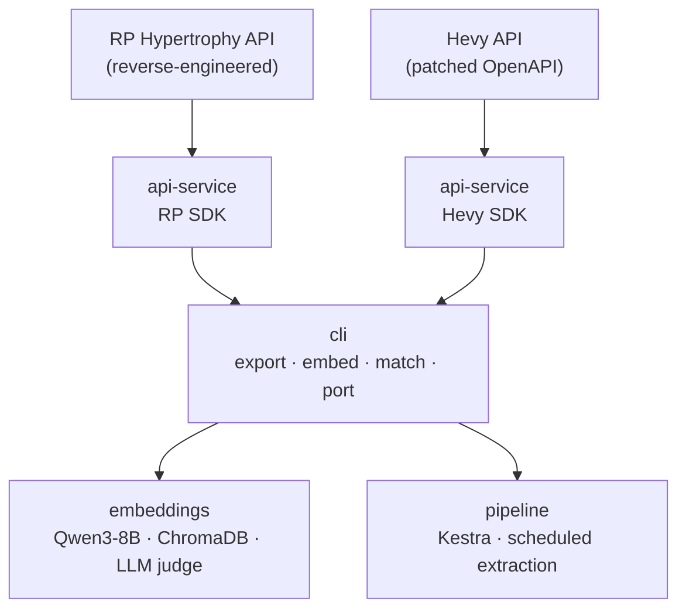

# rp-to-hevy

> I love Hevy's UI but I train with RP. So I built a pipeline to port my entire workout history — reverse-engineered API, AI exercise matching, and all.

## Why This Exists

I use two fitness apps. [RP Hypertrophy](https://rpstrength.com/) programs my training — it auto-regulates weight, volume, and RIR based on sport science, and it's genuinely great at that. But its interface is a laggy PWA that feels like a web page pretending to be an app. [Hevy](https://www.hevyapp.com/) is the opposite — a proper native Android app with a clean UI, social features, and a workout log I actually enjoy using.

I wanted my entire RP training history inside Hevy. One command, every mesocycle, every set. That's what this project does.

The catch: nothing about this was straightforward.

## The Three Problems I Had to Solve

### 1. RP has no public API

RP doesn't document or expose an API. I reverse-engineered it by intercepting traffic from the mobile app — mapping endpoints, figuring out auth, and building a Python SDK from scratch. The whole thing is undocumented and could break any time RP ships an update.

### 2. Hevy's OpenAPI spec is broken

Hevy *does* have a developer API, but its OpenAPI spec is riddled with violations that crash every code generator I tried. I had to build a [Bun/TypeScript tool](scripts/hevy-extract/README.md) that fetches the spec, patches the broken parts, and produces something that actually generates valid code.

### 3. Exercises don't match across apps

"Bench Press (Medium Grip)" in RP is "Bench Press (Barbell)" in Hevy. "Pullup (Underhand Grip)" is "Chin Up". "Machine Flye" is "Butterfly (Pec Deck)". There are ~315 RP exercises and ~433 Hevy exercises with completely different naming conventions, and equipment info lives in a separate field in RP but is baked into the title in Hevy. String matching doesn't work. I needed AI.

## How the Exercise Matching Works

A three-stage pipeline maps every RP exercise to its Hevy equivalent:

1. **Embed** — Each exercise gets turned into a rich text string (name + equipment + muscle groups) and encoded into a vector using [Qwen3-Embedding-8B](https://huggingface.co/Qwen/Qwen3-Embedding-8B). Vectors go into ChromaDB.
2. **Search** — For every RP exercise, query the Hevy collection by cosine similarity and pull the top-K nearest candidates.
3. **Judge** — An LLM reviews each RP exercise against its candidates and picks the single best match. Results land in `llm-matches.yaml`.

The pipeline achieves **92% muscle group precision@1** and **75% ground truth accuracy** (weighted, on 100 human-verified pairs). A confidence-weighted evaluation system discounts ambiguous matches so the model isn't penalized for cases even a human would debate. See the [embeddings package](packages/embeddings/README.md) for the full methodology.

## Architecture


```mermaid
flowchart TD
    RP["RP Hypertrophy API<br/>(reverse-engineered)"]
    Hevy["Hevy API<br/>(patched OpenAPI)"]

    RPSDK["api-service<br/>RP SDK"]
    HevySDK["api-service<br/>Hevy SDK"]

    CLI["cli<br/>export · embed · match · port"]

    Embeddings["embeddings<br/>Qwen3-8B · ChromaDB · LLM judge"]
    Pipeline["pipeline<br/>Kestra · scheduled extraction"]

    RP --> RPSDK
    Hevy --> HevySDK

    RPSDK --> CLI
    HevySDK --> CLI

    CLI --> Embeddings
    CLI --> Pipeline
```

The core command is **`port-rp-workout-to-hevy`** — it fetches every mesocycle from RP, maps exercises through the AI match file, transforms sets (lb to kg, duration clamping), deduplicates against existing Hevy workouts, and creates or updates them via the Hevy API.

## Build System & CI

### mise — single source of truth

[mise](https://mise.jdx.dev/) manages everything: Python 3.12, uv, ruff, hk, hadolint, trufflehog, and 15+ other tools. One `mise install` provisions the entire dev environment. Tasks are defined per-package with monorepo routing (`mise //packages/cli:build`), and `mise all-ci` reproduces the full CI pipeline locally.

### Remote Docker builds over Tailscale

CI doesn't use GitHub's hosted runners for Docker builds. Instead, I run a persistent BuildKit daemon on my home server — a machine that was sitting there doing nothing — and connect to it from GitHub Actions over [Tailscale](https://tailscale.com/). Direct UDP connection, no SSH tunnels, Tailscale ACLs restricting access to the builder port.

Because the daemon is long-lived, BuildKit's cache layers persist across CI runs. Repeat builds finish in **under 30 seconds** — faster than any commercial CI builder I tried, and completely free. If the home server is unreachable, CI falls back gracefully to a local builder.

### Security-first pipeline

Every image goes through **build → scan → push** gating:

1. Docker builds with BuildKit secret mounts (tokens never baked into layers)
2. [TruffleHog](https://github.com/trufflesecurity/trufflehog) scans the built image for leaked secrets
3. Only clean images get pushed to the registry

All GitHub Actions are pinned by commit SHA (managed by [pinact](https://github.com/suzuki-shunsuke/pinact)), base images use SHA-256 digests, apt packages are version-pinned, and [zizmor](https://woodruffw.github.io/zizmor/) audits every workflow for security issues.

### Polyglot linting with hk

[hk](https://hk.jdx.dev/) orchestrates pre-commit hooks across the entire stack: ruff for Python, biome for JS/TS, hadolint for Dockerfiles, taplo for TOML, yamlfmt for YAML, and dclint for docker-compose. A single `mise lint` runs them all.

## Quick Start

The only prerequisite is [mise](https://mise.jdx.dev/).

```bash
curl https://mise.run | sh            # install mise
git clone <repo-url> && cd rp-to-hevy
mise install                          # provision all tools
mise prepare                          # uv sync --all-packages
mise lint                             # hk check -a
mise //...:test                       # test every package
```

### Porting your workouts

```bash
# Preview what would be imported
mise //packages/cli:cli port-rp-workout-to-hevy --dry-run

# Import everything from a specific date
mise //packages/cli:cli port-rp-workout-to-hevy --start-date 2026-01-01

# Re-sync previously imported workouts
mise //packages/cli:cli port-rp-workout-to-hevy --upsert
```

You'll need an RP bearer token (intercepted from app traffic, saved to `token.txt`) and a Hevy API key (`HEVY_API_KEY` env var, from [hevy.com/settings](https://hevy.com/settings?developer)).

## What's Inside

| Path | What it does |
| --- | --- |
| [`packages/api-service`](packages/api-service/README.md) | Auto-generated async Python SDKs for both APIs |
| [`packages/cli`](packages/cli/README.md) | Click CLI — the main interface for everything |
| [`packages/embeddings`](packages/embeddings/README.md) | Embedding pipeline, similarity search, LLM judge, evaluation |
| [`packages/pipeline`](packages/pipeline/README.md) | Kestra orchestration for scheduled extraction |
| [`scripts/hevy-extract`](scripts/hevy-extract/README.md) | Bun/TS tool that fetches and patches Hevy's broken OpenAPI spec |
